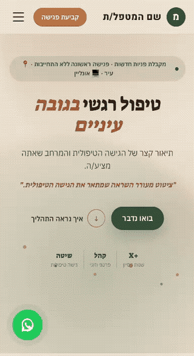
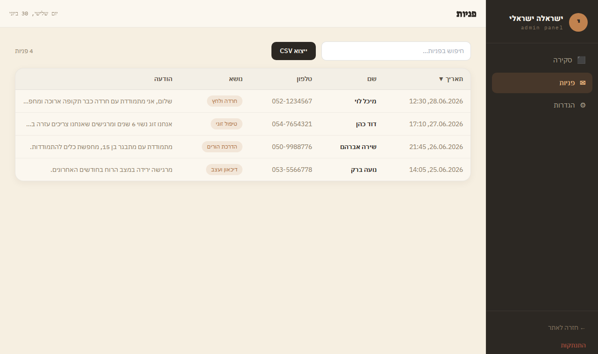
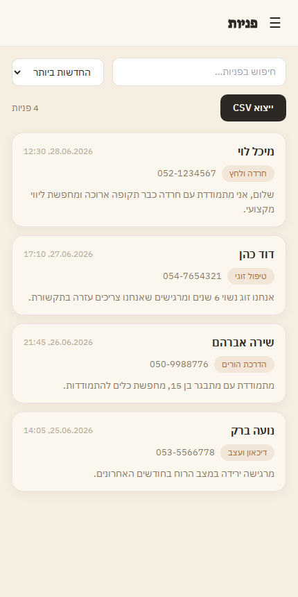
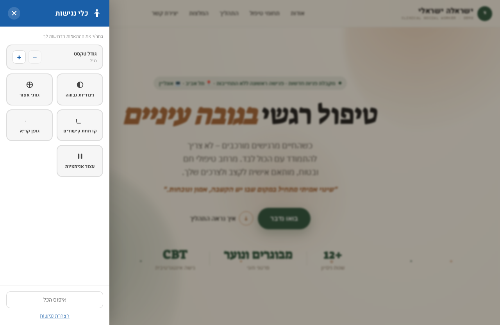
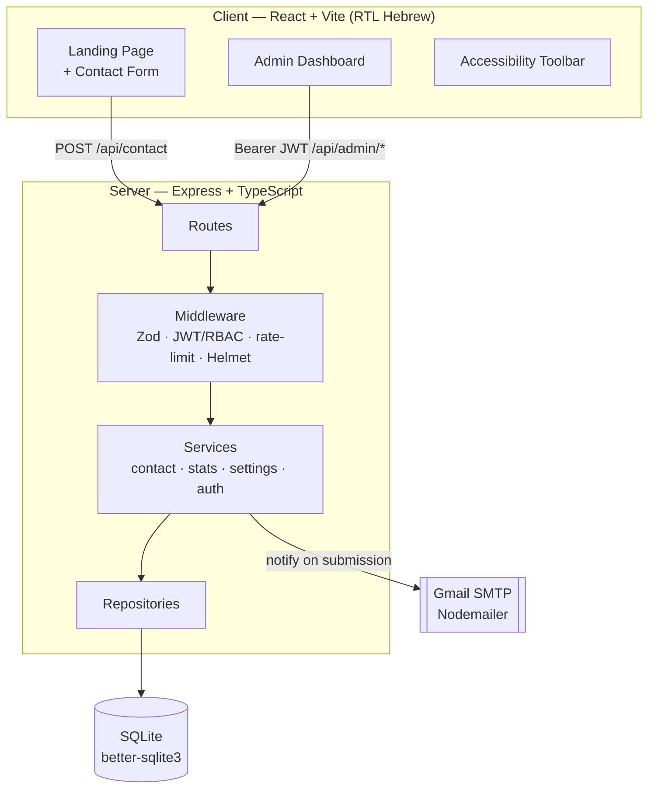
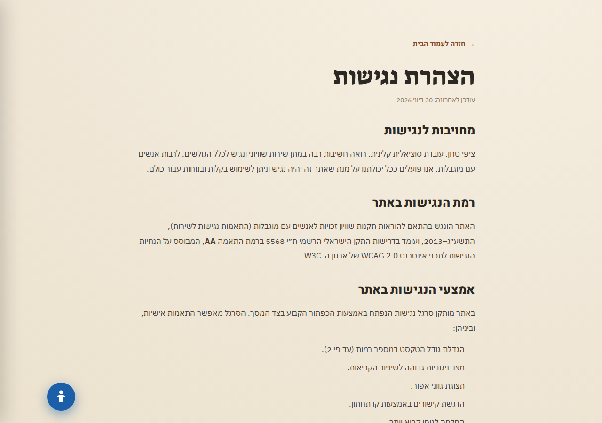

Therapy Clinic Platform Template Website

A production-deployed, full-stack web platform for a private therapy clinic: a polished **RTL Hebrew** marketing site for clients, plus a secure **admin dashboard** for managing contact-form submissions — built with a type-safe, layered backend and an accessibility layer that meets Israeli standard **IS 5568 (WCAG 2.0 AA)**.

[](https://therapy-clinic.fly.dev)
&nbsp;


> **▶ Live site:** <https://therapy-clinic.fly.dev>

---

## Table of contents

- [Overview](#overview)
- [Demo](#demo)
- [Highlights](#highlights)
- [Tech stack](#tech-stack)
- [Getting started](#getting-started)
- [Architecture](#architecture)
- [Security](#security)
- [Testing](#testing)
- [Accessibility](#accessibility)
- [API reference](#api-reference)
- [Deployment](#deployment)

---

## Overview

The platform has two faces:

1. **Public site** — a fully responsive, right-to-left Hebrew landing page with scroll-reveal animations, an ambient particle background, client testimonials, a treatment-specialties section, and a validated contact form. Every submission is persisted and emails the clinic owner.
2. **Admin dashboard** — a JWT-protected panel where the owner reviews submissions (overview stats + charts, a searchable/sortable table, CSV export) and manages notification settings and credentials.

It is engineered to demonstrate end-to-end depth: type-safe backend architecture, real security hardening, a three-layer automated test suite, CI, and legal-grade accessibility — all running on a zero-external-services SQLite stack.

---

## Demo

### Landing page

RTL Hebrew, earth-tone design system, scroll-driven animation, fully responsive.

<table>
  <tr>
    <th>Desktop</th>
    <th>Mobile</th>
  </tr>
  <tr>
    <td></td>
    <td></td>
  </tr>
</table>

### Admin dashboard

JWT-protected. Overview with stats and a topic breakdown, plus a submissions view that adapts from a sortable table on desktop to stacked cards on mobile.


<table>
  <tr>
    <th>Contacts — desktop table</th>
    <th>Contacts — mobile cards</th>
  </tr>
  <tr>
    <td></td>
    <td></td>
  </tr>
</table>

### Accessibility toolbar

A floating widget lets any visitor adjust the experience — text size (up to 2×), high contrast, grayscale, link underlines, a readable font, and motion reduction — with preferences persisted across visits.

<table>
  <tr>
    <td></td>
    <td></td>
  </tr>
</table>

---

## Highlights

- **🎨 Bespoke RTL Hebrew UI** — custom earth-tone design system, scroll-reveal animations, ambient particles, and a fully responsive layout tuned down to small phones.
- **🔒 Real security hardening** — JWT access tokens + rotating httpOnly refresh tokens, RBAC, bcrypt, Helmet, CORS, Zod validation, and per-route rate limiting — each backed by an attack-oriented test.
- **🧱 Type-safe layered backend** — Express in strict TypeScript, organised as `routes → middleware → services → repositories`, with a Zod-validated environment.
- **♿ Legal-grade accessibility** — meets Israeli standard **IS 5568 / WCAG 2.0 AA**, including a visitor accessibility toolbar and a formal accessibility statement page.
- **✅ Three-layer test suite** — fast API/integration tests (Vitest + Supertest), dedicated security tests, and Playwright browser E2E — all wired into GitHub Actions CI.
- **🚀 Deployed** — containerised with Docker and running on Fly.io.

---

## Tech stack

| Layer | Technologies |
|---|---|
| **Frontend** | React, Vite, Tailwind CSS (RTL / Hebrew), React Router |
| **Backend** | Node.js, Express, **TypeScript** (strict) |
| **Database** | SQLite via `better-sqlite3` (no external services) |
| **Auth** | JWT access tokens, rotating httpOnly refresh tokens, RBAC, bcrypt |
| **Email** | Nodemailer over Gmail SMTP |
| **Hardening** | Helmet, CORS, Zod validation, rate limiting, pino structured logging |
| **Testing** | Vitest, Supertest, Playwright |
| **CI / Deploy** | GitHub Actions, Docker, Fly.io |

---

## Getting started

### Prerequisites

- Node.js 18+
- A Gmail account (for contact-form notifications — optional; the app runs without it)

### 1. Install

```bash
npm run install:all   # installs root, server, and client dependencies
```

### 2. Configure environment

```bash
cp .env.example .env
```

Then fill in `.env` (lives at the project **root**, read by the server):

```ini
PORT=4000
JWT_SECRET=<long random string — e.g. run: openssl rand -hex 32>

ADMIN_USERNAME=admin
ADMIN_PASSWORD_HASH=<generated below>

GMAIL_USER=your@gmail.com
GMAIL_APP_PASSWORD=xxxx xxxx xxxx xxxx
ADMIN_NOTIFICATION_EMAIL=your@gmail.com
```

<details>
<summary><strong>How to generate a Gmail App Password</strong></summary>

Gmail requires a 16-character **App Password**, not your normal password.

1. Go to <https://myaccount.google.com/security>.
2. Enable **2-Step Verification** (required before App Passwords appear).
3. Visit <https://myaccount.google.com/apppasswords>.
4. Choose **Mail**, name it, and click **Create**.
5. Copy the 16-character password into `.env` as `GMAIL_APP_PASSWORD` (spaces are fine).

> If you can't see the App Passwords page, 2-Step Verification isn't fully enabled, or it's a managed Workspace account with it disabled.

</details>

<details>
<summary><strong>How to hash the admin password</strong></summary>

Generate a bcrypt hash and place the printed line into `.env`:

```bash
npm --prefix server run hash-password -- "your-chosen-password"
# prints: ADMIN_PASSWORD_HASH=$2a$12$....
```

> **Changing it later:** the dashboard's Settings tab verifies your current password and outputs a fresh `ADMIN_PASSWORD_HASH=...` line to paste into `.env`. The password itself is never stored in the database — only the hash in `.env`.

</details>

### 3. Run

```bash
npm run dev          # runs client + server together
```

- Public site → <http://localhost:5173/>
- Admin login → <http://localhost:5173/admin/login>
- API (Express) → <http://localhost:4000>

The Vite dev server proxies `/api/*` to Express, so the contact form and dashboard work seamlessly.

<details>
<summary><strong>Other commands</strong></summary>

```bash
npm run dev:server   # Express only (:4000)
npm run dev:client   # Vite only (:5173)
npm run build        # build client into client/dist
npm start            # Express serves API + built client on :4000
```

</details>

---

## Architecture

The frontend talks to a layered Express API; every request passes through validation, auth, and rate-limit middleware before reaching business logic, which is the only layer that touches the database or mailer.



<details>
<summary><strong>Project structure</strong></summary>

```
therapy-clinic/
├── client/                # React + Vite frontend (RTL Hebrew)
│   └── src/
│       ├── pages/         # LandingPage, AdminLogin, AdminDashboard, AccessibilityStatement
│       ├── components/    # Navbar, Hero, ContactForm, AccessibilityBar, dashboard/*
│       ├── hooks/         # useScrollAnimation, useAuth
│       └── utils/         # date formatting, a11yFont (text scaler)
├── server/                # Express backend (TypeScript)
│   └── src/
│       ├── config/        # env.ts (Zod-validated environment)
│       ├── db/            # database + repositories
│       ├── services/      # contact / stats / settings / auth business logic
│       ├── middleware/    # validate, auth (JWT+RBAC), rateLimit, error
│       ├── schemas/       # Zod request schemas
│       ├── routes/        # contact + admin routers
│       ├── email/         # mailer (Nodemailer)
│       ├── app.ts         # Express app factory (shared with tests)
│       └── server.ts      # entry point (listen + graceful shutdown)
├── e2e/                   # Playwright browser tests
├── .github/workflows/     # CI (typecheck, test, build)
├── Dockerfile · fly.toml  # container + Fly.io deploy
└── package.json           # root scripts (run both apps together)
```

</details>

---

## Security

Each measure below is paired with a dedicated test in `server/tests/security.test.ts`.

| Threat | Defense |
|---|---|
| **SQL injection** | Parameterized queries via `better-sqlite3` — values are always data, never SQL |
| **XSS** | Payloads stored verbatim; React escapes on render, the mailer uses `escapeHtml()` |
| **JWT forgery** | HMAC-SHA256 signature verification rejects any tampered token |
| **Token replay** | Single-use refresh-token rotation revokes the presented token immediately |
| **Brute force** | Per-route rate limiting (5/min contact, 10/15min auth in production) |
| **Unauthenticated writes** | `requireAuth` middleware gates all `/api/admin/*` routes (RBAC) |

---

## Testing

Three layers of automated tests, all green in CI.

### Layer 1 — API & integration (Vitest + Supertest)

In-memory HTTP requests straight to Express — no browser, no network. ~1 second.

```bash
npm run test:api
```

| File | Covers |
|---|---|
| `server/tests/contact.test.ts` | Valid submission, missing fields, bad email/phone, message boundaries |
| `server/tests/auth.test.ts` | Login, httpOnly cookie, protected routes, refresh rotation, logout |
| `server/tests/settings.test.ts` | Notification save, persistence, email trigger (mailer mocked) |
| `server/tests/security.test.ts` | SQL injection, XSS, JWT forgery/expiry/reuse, auth, rate limiting |

### Layer 2 — Security tests

Bundled in the Vitest suite (`security.test.ts`) — see the [Security](#security) table.

### Layer 3 — End-to-end (Playwright)

Drives a real Chromium browser through the full experience (forms, navigation, RTL layout, state transitions).

```bash
cp .env.playwright.example .env.playwright   # one-time: set PLAYWRIGHT_ADMIN_PASSWORD
npm run test:e2e        # headless
npm run test:e2e:ui     # visual step-by-step debugger
```

| File | Covers |
|---|---|
| `e2e/contact-form.spec.ts` | Empty form blocked, valid submit → success state, form reset |
| `e2e/admin-login.spec.ts` | Wrong password error, correct login redirect, unauthenticated `/admin` redirect |
| `e2e/settings-email.spec.ts` | Notification email saves and persists across reload |

---

## Accessibility

The site is built to comply with the Israeli **Equal Rights for Persons with Disabilities Regulations (2013)** and standard **IS 5568**, which maps to **WCAG 2.0 Level AA**.

- **Accessibility toolbar** — a floating widget offering text resizing (engine-agnostic, works on iOS/WebKit where CSS `zoom` fails on `vw` text), high contrast, grayscale, link underlines, a readable font, and motion reduction. Preferences persist via `localStorage`.
- **Accessibility statement page** (`/accessibility`) — a formal הצהרת נגישות declaring the conformance level, listing the available adjustments and known limitations, and providing the accessibility coordinator's contact details.
- **Foundations** — semantic landmarks, a "skip to content" link, keyboard navigation, alt text, `aria-live` form feedback, and respect for the OS `prefers-reduced-motion` setting.



---

## API reference

| Method | Route | Auth | Description |
|--------|-------|------|-------------|
| GET  | `/api/health`            | —  | Health check |
| POST | `/api/contact`           | —  | Save submission, email the clinic (rate-limited) |
| POST | `/api/admin/login`       | —  | Access token + sets httpOnly refresh cookie |
| POST | `/api/admin/refresh`     | 🍪 | Rotate refresh cookie, return access token |
| POST | `/api/admin/logout`      | 🍪 | Revoke refresh token, clear cookie |
| GET  | `/api/admin/submissions` | ✅ | All submissions |
| GET  | `/api/admin/stats`       | ✅ | Aggregated dashboard stats |
| GET  | `/api/admin/settings`    | ✅ | Current settings |
| PUT  | `/api/admin/settings`    | ✅ | Update email / toggle / password |

✅ = `Authorization: Bearer <accessToken>` (15-min access token).
🍪 = httpOnly refresh cookie (7-day, rotated each use, revocable in the DB).
The client keeps the access token in `localStorage` and silently calls `/refresh` on a `401` before retrying.

---

## Deployment

Containerised with the root `Dockerfile` and deployed on **Fly.io** (`fly.toml`, region `fra`). The production image builds the client and runs Express, which serves both the API and the static front-end from a single origin.

```bash
fly deploy
```

> **Notes**
> - The SQLite file is created automatically on first run and is git-ignored; tests use an in-memory database.
> - If Gmail credentials are missing, the server still runs and saves submissions — it just logs a warning and skips email.
> - Email notifications can be toggled and the destination address changed from the **Settings** tab without touching `.env`.
